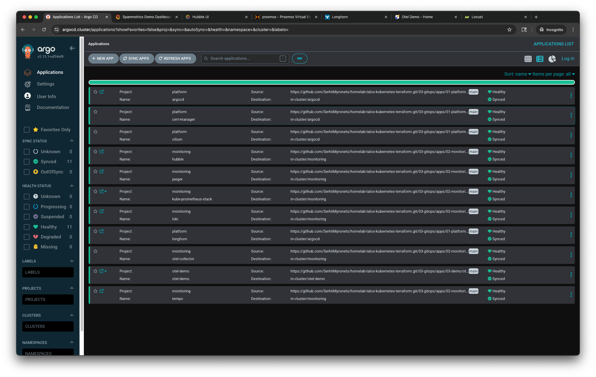

# 03-gitops

This stage defines and manages the full application lifecycle in the Kubernetes cluster using GitOps principles.
Through Argo CD, all components—including platform services, observability tools, and workloads—are deployed in a declarative and reproducible manner.

## Purpose

This layer defines the full GitOps deployment model for the cluster. It separates applications into logical stages—platform services, observability stack, and demo workloads—each managed by Argo CD Applications.

Argo CD Applications are bootstrapped in a controlled order to ensure service readiness and interdependency handling. This approach enables reproducible, declarative deployment of all Kubernetes workloads via Git.

## Structure

| Layer         | Path                  | Description                                    |
| ------------- | --------------------- | ---------------------------------------------- |
| Applications  | `applications/`       | Argo CD Application definitions (per stage)    |
| Platform Apps | `apps/01-platform/`   | Argo CD, cert-manager, Cilium, Longhorn        |
| Monitoring    | `apps/02-monitoring/` | Prometheus, Grafana, Tempo, Loki, Jaeger, etc. |
| Demo          | `apps/03-demo/`       | OpenTelemetry Demo (`otel-demo`)               |

## Ingress Access

All Ingress resources created in this stage are configured to work with the NGINX Ingress Controller.
They receive static IPs from the Cilium LoadBalancer IP pool. By default, services are exposed via `192.168.100.80`.

TLS configuration blocks are included in the manifests but commented out. To enable TLS for Ingress resources, uncomment the relevant sections in the Ingress manifests. Then, download the self-signed certificate and add it to your local trust store (e.g., macOS Keychain):

```bash
./03-gitops/scripts/extract-root-cert.sh
```

This script checks the `ca.crt` field in the `ingress-tls` secret under the `cert-manager` namespace.
If not found, it falls back to `tls.crt`. The output is saved to `local-cluster-root-ca.crt`.

You can then add this certificate to your system trust store:

* **macOS**: open Keychain Access → drag the file into "System" → set trust to "Always Trust"
* **Linux**: copy to `/usr/local/share/ca-certificates/` and run `sudo update-ca-certificates`.

To make Ingress hosts resolvable, you can:

* Update your local `/etc/hosts` file (example below):

```bash
192.168.100.80  argocd.homelab.local grafana.homelab.local prometheus.homelab.local \
                alertmanager.homelab.local loki.homelab.local tempo.homelab.local \
                jaeger.homelab.local longhorn.homelab.local \
                otel-demo.homelab.local otel-demo-loadgen.homelab.local
```

* Or configure wildcard DNS entries (e.g., \*.homelab.local) pointing to the Ingress IP.

## Usage

> **Pre-requisite**: Ensure Argo CD is already running in your cluster. It was installed via Helm in the previous stage (`02-bootstrap`).

It is recommended to apply the Argo CD Applications in order, as each layer builds upon the previous one.

### Step-by-step deployment

```bash
# 1. Apply platform components
kubectl apply -f applications/01-platform-bootstrap.yaml

# 2. Apply observability stack
kubectl apply -f applications/02-monitoring-bootstrap.yaml

# 3. Apply the OpenTelemetry demo
kubectl apply -f applications/03-otel-demo.yaml
```

### Application breakdown

* `01-platform-bootstrap.yaml`

  * Adds Cilium to Argo CD management (already pre-installed)
  * Installs cert-manager with self-signed CA
  * Deploys Ingress resources for Argo CD and Longhorn UIs

* `02-monitoring-bootstrap.yaml`

  * Installs kube-prometheus-stack, OpenTelemetry Collector, Loki, Tempo, Jaeger, and Hubble
  * Deploys Ingress resources for Hubble, Jaeger, Alertmanager, Grafana, Prometheus, Loki, and Tempo

* `03-otel-demo.yaml`

  * Deploys the `otel-demo`, an OpenTelemetry example application representing a 21-microservice online store
  * Exposes the frontend and load generator via Ingress resources

Once all applications are synced, your cluster will be fully equipped with GitOps management, observability, and demo workloads for instrumentation testing.

## UI Previews

Below are sample screenshots of key components once the cluster is fully deployed.

### Argo CD

GitOps view with synced applications.



### Grafana

Dashboards for service-level latency and metrics.


### Longhorn

Storage status and volume health.


### Hubble

Service map from Cilium showing network flows.


### OpenTelemetry Demo

Main frontend page of the demo application.


### Load Generator

Locust UI generating traffic to the demo.


## Navigation

[← 02-bootstrap](../02-bootstrap/README.md) • [↑ Main project README](../../README.md)


