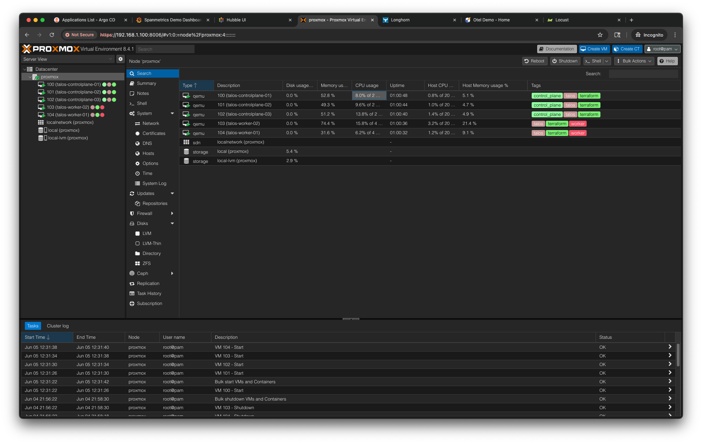
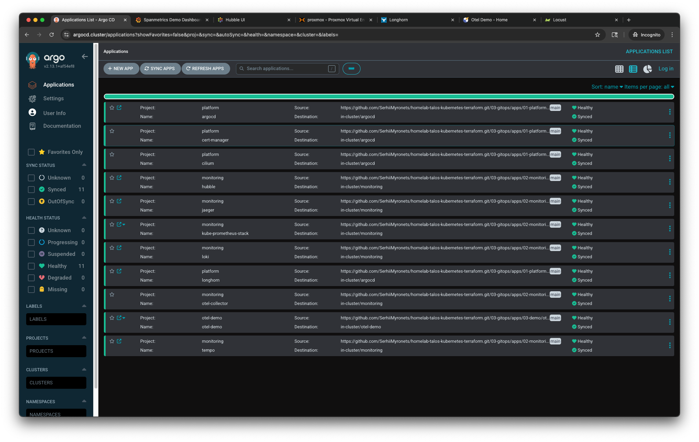
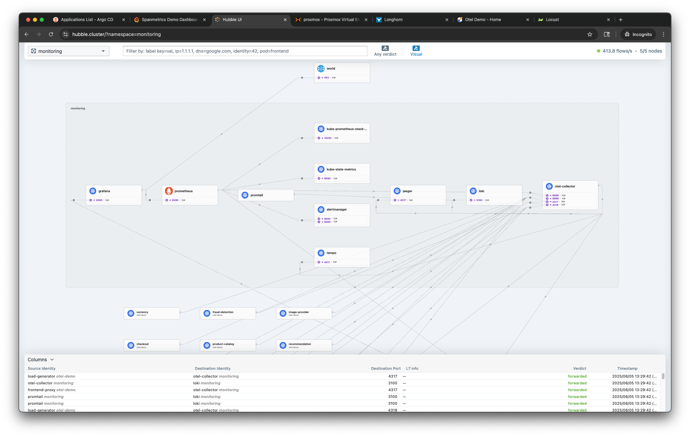
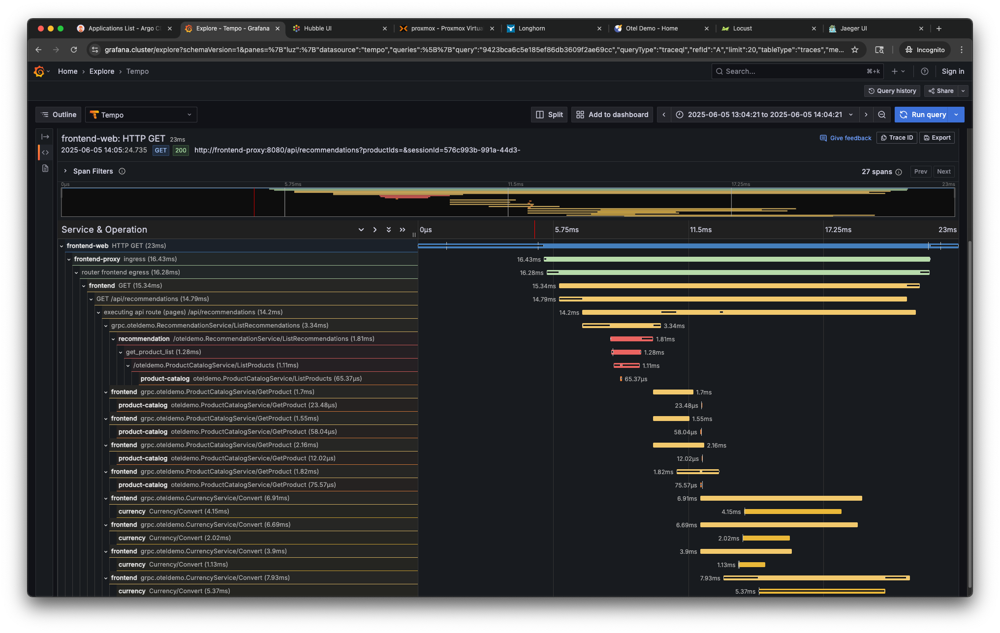

# Talos Kubernetes Cluster on Proxmox with Terraform

This repository contains infrastructure-as-code configurations for deploying a minimal, production-grade Kubernetes cluster using Talos Linux and Terraform on Proxmox VE. This repository provides a fully declarative, script-free setup: Talos is configured and installed automatically during VM provisioning via Terraform.

## Overview

This project is designed for enthusiasts, students, or professionals who want to gain hands-on experience with a production-grade GitOps Kubernetes cluster using modest hardware — such as an old laptop or mini PC. It offers a fully automated deployment pipeline without requiring cloud resources or expensive infrastructure.

The Kubernetes cluster is composed of multiple control plane and worker nodes provisioned on a Proxmox host using Terraform. Talos Linux is injected and configured automatically as part of the VM provisioning step. The configuration supports high availability (HA) and uses a virtual IP for the control plane endpoint. The deployment includes core platform components (ingress, certificate management, GitOps), observability stack (metrics, logs, traces), and demo microservices applications for testing.

## Architecture

The Kubernetes cluster operates in an isolated subnet (`192.168.100.0/24`) with virtual machines provisioned directly on a Proxmox VE host. A dedicated NAT bridge (`vmbr1`) is used to provide connectivity. Each node is assigned a static IP from this subnet. The control plane nodes are configured in high availability (HA) mode and share a virtual IP (`192.168.100.50`) for the Kubernetes API.

```
Proxmox VE (192.168.1.100)
  └─ vmbr1: 192.168.100.1 (NAT Gateway)
       ├─ controlplane-1: 192.168.100.60
       ├─ controlplane-2: 192.168.100.61
       ├─ worker-1:      192.168.100.70
       ├─ worker-2:      192.168.100.71
       └─ cluster VIP:   192.168.100.50 (Kubernetes API)
```

A static route to `192.168.100.0/24` must be configured on the developer workstation via the Proxmox host.

## Features

* Support for high availability across control-plane nodes
* Fully declarative setup (no shell scripts)
* Talos Linux installed and configured via Terraform
* Proxmox-native VM provisioning
* GitOps with Argo CD and Helmfile
* Cilium CNI with kube-proxy disabled
* Longhorn for persistent volumes
* Full observability stack with OpenTelemetry Collector (metrics, logs, traces via Tempo, Loki, Prometheus, Grafana)
*Demo microservices instrumented for end-to-end tracing and performance metrics collection*

## Directory Structure

| Path                                                  | Description                                                                                |
| ----------------------------------------------------- | ------------------------------------------------------------------------------------------ |
| [`00-prerequisite/`](./00-prerequisite/README.md)     | Environment preparation: hardware requirements, dependencies, Proxmox and networking setup |
| [`01-infrastructure/`](./01-infrastructure/README.md) | Terraform configurations for Proxmox VM provisioning and Talos injection                   |
| [`02-bootstrap/`](./02-bootstrap/README.md)           | Installs base components (cert-manager, ingress, Argo CD, Longhorn, etc.) using Helmfile   |
| [`03-gitops/`](./03-gitops/README.md)                 | Deploys applications via Argo CD, including observability stack and demo workloads         |


## UI Preview

Below is a preview of the cluster after deployment. For a complete set of UI screenshots, see the [03-gitops UI Previews](./03-gitops/README.md#ui-previews).

|                    Proxmox                    |                    Argocd                    |
|:---------------------------------------------:|:--------------------------------------------:|
|  |  |
|                   HubbleUI                    |                    Tempo                     |
|   |   |

## Getting Started

To get started, begin with [00-prerequisite](./00-prerequisite/README.md), which walks through system setup, required dependencies, and network configuration.