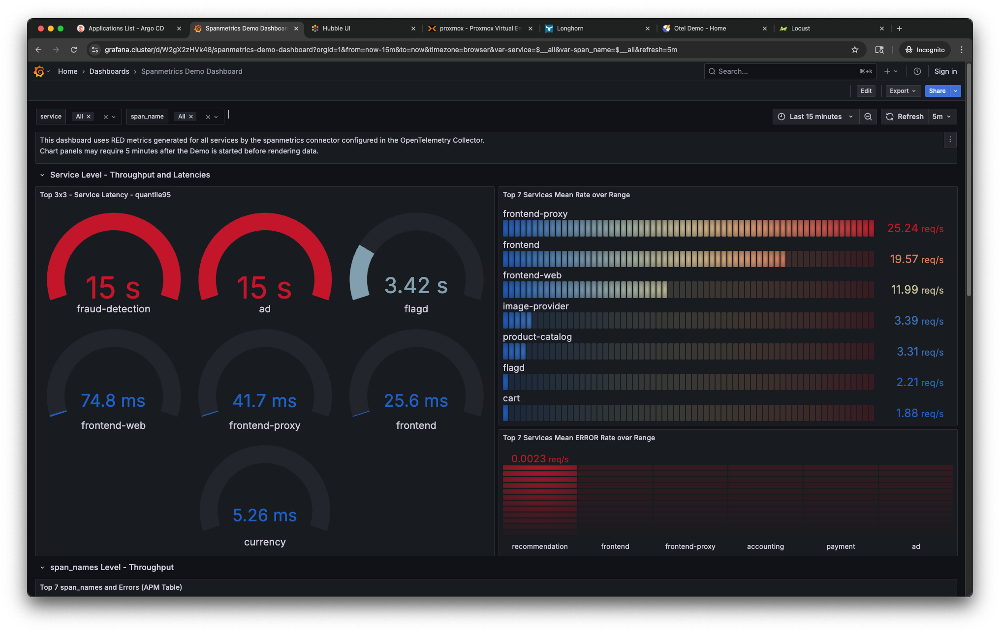

# Talos Kubernetes Cluster on Proxmox with Terraform

This repository contains infrastructure-as-code configurations for deploying a minimal, production-grade Kubernetes cluster using Talos Linux and Terraform on Proxmox VE. The entire setup process is fully declarative and does not rely on any shell scripts. Talos is configured and installed directly through Terraform.

This project demonstrates how to build a fully automated, production-grade Kubernetes cluster from scratch on bare-metal using modern GitOps and observability tooling. It is designed to simulate real-world infrastructure workflows in a home lab environment, suitable for DevOps learning, testing, and experimentation.

## Overview

The Kubernetes cluster is composed of multiple control plane and worker nodes provisioned on a Proxmox host using Terraform. Talos Linux is injected and configured automatically as part of the VM provisioning step. The configuration supports high availability (HA) and uses a virtual IP for the control plane endpoint. The deployment includes core platform components (ingress, certificate management, GitOps), observability stack (metrics, logs, traces), and demo microservices applications for testing.

## Architecture

The Kubernetes cluster operates in an isolated subnet (`192.168.100.0/24`) with virtual machines provisioned directly on a Proxmox VE host. A dedicated NAT bridge (`vmbr1`) is used to provide connectivity. Each node is assigned a static IP from this subnet. The control plane nodes are configured in high availability (HA) mode and share a virtual IP (`192.168.100.50`) for the Kubernetes API.

```
Proxmox VE (192.168.1.100)
  └─ vmbr1: 192.168.100.1 (NAT Gateway)
       ├─ controlplane-1: 192.168.100.60
       ├─ controlplane-2: 192.168.100.61
       ├─ worker-1:      192.168.100.70
       ├─ worker-2:      192.168.100.71
       └─ cluster VIP:   192.168.100.50 (Kubernetes API)
```

A static route to `192.168.100.0/24` must be configured on the developer workstation via the Proxmox host.

## Features

* GitOps-first deployment flow with Argo CD and Helmfile
* No shell scripts or imperative commands — full Infrastructure-as-Code
* High availability for control-plane nodes (HA-ready)
* Talos Linux installed and configured via Terraform
* Proxmox-native VM provisioning
* Cilium CNI with kube-proxy disabled
* Longhorn for persistent volumes
* OpenTelemetry-based observability (Tempo, Loki, Prometheus, Grafana)
* Demo services with instrumentation for tracing and metrics

## Directory Structure

| Path                                                 | Description                                                                                |
| ---------------------------------------------------- | ------------------------------------------------------------------------------------------ |
| [`00-prerequisite/`](./00-prerequisite/README.md)    | Environment preparation: hardware requirements, dependencies, Proxmox and networking setup |
| [`01-infrastructure/`](.01-infrastructure/README.md) | Terraform configurations for Proxmox VM provisioning and Talos injection                   |
| [`02-bootstrap/`](./02-bootstrap/README.md)          | Installs base components (cert-manager, ingress, Argo CD, Longhorn, etc.) using Helmfile   |
| [`03-gitops/`](./03-gitops/README.md)                | Deploys applications via Argo CD, including observability stack and demo workloads         |
| `README.md`                                          | Project overview and step-by-step deployment guide                                         |

## Stack Overview

* **Terraform** – Proxmox VM provisioning & Talos configuration
* **Talos Linux** – Minimal, secure OS for Kubernetes nodes
* **Cilium** – eBPF CNI with kube-proxy replacement and Hubble
* **Longhorn** – Distributed block storage for Kubernetes
* **Helmfile** – Declarative Helm chart manager
* **Argo CD** – GitOps delivery of all apps
* **Prometheus / Grafana** – Metrics collection and dashboards
* **Loki / Tempo / Jaeger** – Logging and distributed tracing
* **otel-demo** – Sample microservices for observability testing

## UI Preview (Production-ready Tools in Action)

| Tool    | Preview                          |
| ------- | -------------------------------- |
| Proxmox |  |
| Argo CD |   |
| Grafana |  |
| Hubble  |    |

## Use Cases

* Home lab experiments with real-world Kubernetes stack
* GitOps training ground with complete app + infra lifecycle
* Observability sandbox for debugging and tracing practices
* CI/CD testing platform with self-hosted GitOps workflows

## Getting Started

To begin, go to [00-prerequisite](./00-prerequisite/README.md), which describes the initial setup and requirements for your system.
